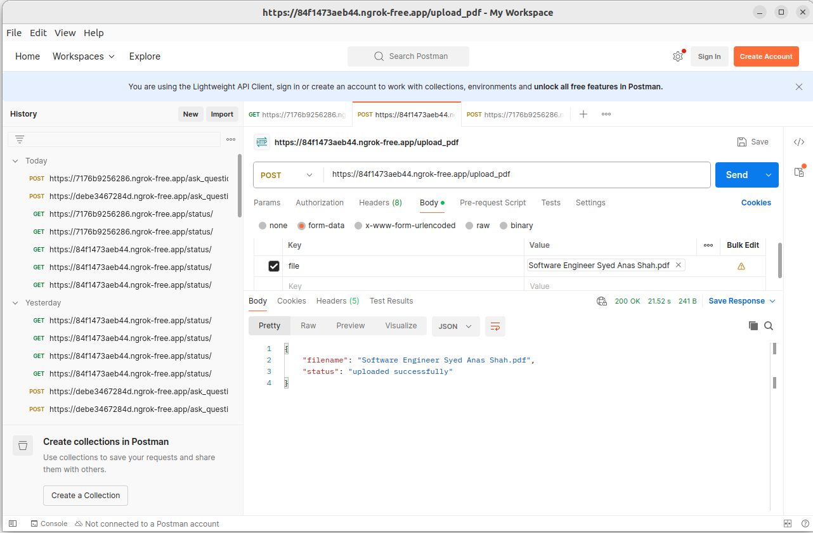
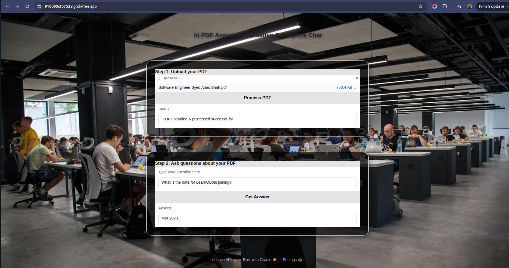
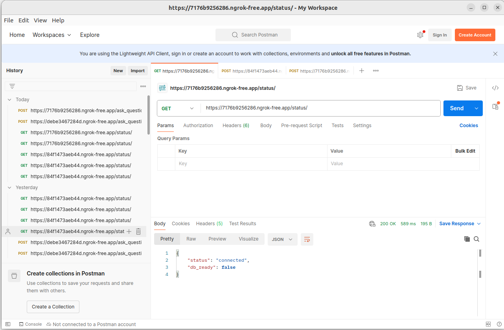

AI PDF Assistant

AI-powered assistant that allows you to upload a PDF, split it into chunks and ask natural language questions about its contents.

Built with:

LangChain

Sentence-Transformers

Hugging Face Transformers

FAISS

Gradio

FastAPI

🚀 Features

Upload PDFs and extract text (ignores scanned PDFs without OCR).

Split large documents into manageable chunks for embeddings.

Store embeddings in FAISS for efficient semantic search.

Adaptive question answering:

Factual mode → strictly uses document context.

Creative mode → blends context with broader insights.

Two interfaces:

Gradio UI (easy-to-use web app).

FastAPI endpoints (programmatic access).

📂 Project Structure
.
├── app.py              # Main FastAPI + Gradio app
├── requirements.txt    # Python dependencies
├── Dockerfile          # Container setup
├── README.md           # Documentation
└── uploaded_pdfs/      # Stored uploaded files

🟢 Running in Google Colab

You can run this project in Google Colab with ngrok tunneling enabled for public access.

!pip install pyngrok
!pip install -q --upgrade bitsandbytes
!pip install -q --upgrade transformers
!pip install gradio PyPDF2 sentence-transformers faiss-cpu transformers langchain pyngrok
!pip install gradio PyPDF2 sentence-transformers faiss-cpu transformers langchain langchain-community pyngrok
!pip install -q gradio PyPDF2 transformers accelerate sentence-transformers faiss-cpu bitsandbytes
!pip install gradio PyPDF2 sentence-transformers faiss-cpu transformers langchain langchain-community pyngrok -q

import gradio as gr
import PyPDF2
from langchain_community.embeddings import HuggingFaceEmbeddings
from langchain_community.vectorstores import FAISS
from langchain.text_splitter import RecursiveCharacterTextSplitter
from langchain.llms import HuggingFacePipeline
from transformers import pipeline
from pyngrok import ngrok
import nest_asyncio
import socket
from fastapi import FastAPI, UploadFile, Form  
import uvicorn                                 
import threading
import shutil
import os

# (Full Google Colab code here, using ngrok for tunnels)


Once executed, it will print two URLs:

🌍 FastAPI Public URL → REST API access

🌍 Gradio Public URL → Web UI

🖥️ Running Locally (without Colab / ngrok)
1️⃣ Install Requirements
python -m venv venv
source venv/bin/activate   # Linux/Mac
venv\Scripts\activate      # Windows

pip install -r requirements.txt

2️⃣ Run the App
python app.py


FastAPI API → http://localhost:8000

Gradio UI → http://localhost:7860

🐳 Running with Docker

Build and run the containerized app:

docker build -t pdf-assistant .
docker run -p 8000:8000 -p 7860:7860 pdf-assistant

📡 FastAPI Endpoints

GET / → Root health check

GET /status → Check DB readiness

POST /upload_pdf → Upload a PDF file

POST /ask_question → Ask a question (form-data field: question)

Swagger UI → http://localhost:8000/docs

🎨 Gradio UI

Two-step interface:

Upload PDF

Ask questions interactively

Accessible at → http://localhost:7860


## 📸 Example Screenshots

- **Upload PDF**
  
  

- **Ask a Question**
  
  

- **API Status Check**
  
  


⚠️ Notes

Scanned PDFs (images) won’t work unless you add OCR (e.g., Tesseract).

Uses flan-t5-base for Q&A (can replace with other Hugging Face models).

## ⚡ GPU Support

This project runs on both **CPU** and **GPU**.  
- Running on **GPU** is highly recommended for faster embeddings and question answering.  
- Make sure you have CUDA installed with PyTorch:

```bash
pip install torch --index-url https://download.pytorch.org/whl/cu121


✨ That’s it! Now you can run the AI PDF Assistant in Colab (with ngrok) or locally (FastAPI + Gradio).